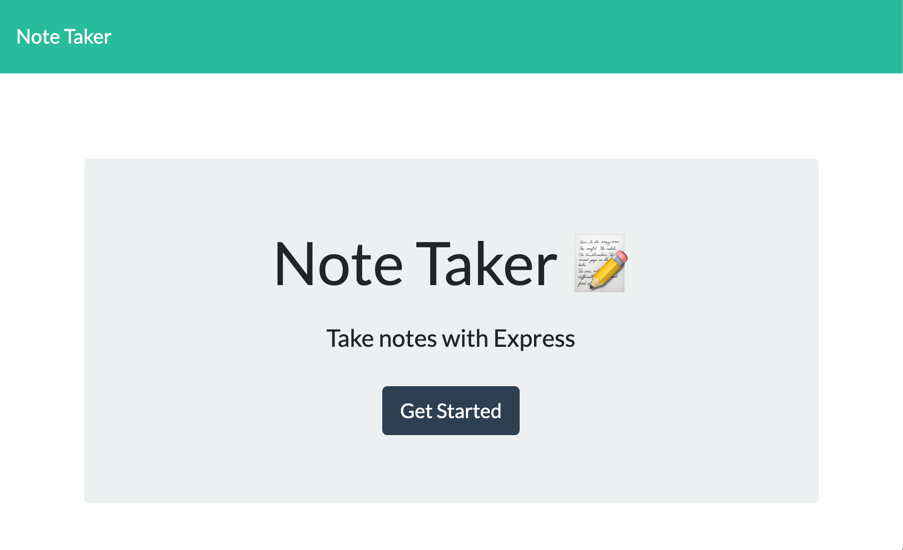
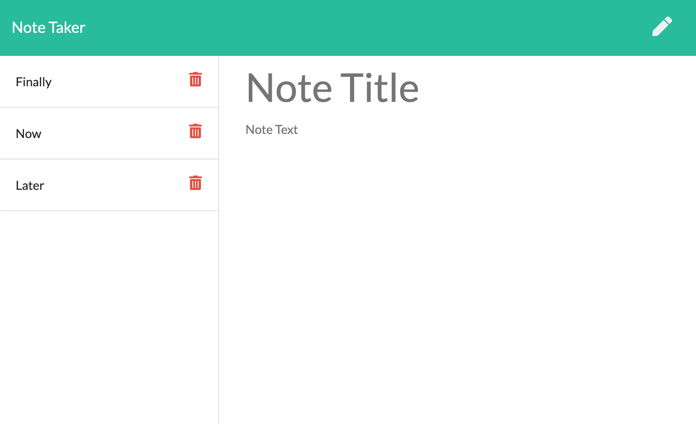

# Note Taker

## Description
  Application to write and save notes using a pre-built frontend and building an Express.js back end, then finally deploying to Heroku.
## Table of Contents
- [Installation](#installation)
- [Usage](#usage)
- [Contributing](#contributing)
- [Deployment](#deployment)
- [Screenshot](#screenshot)
- [License](#license)
- [Tests](#test)
- [Questions](#questions)
## Installation
  Application is deployed on Heroku. If you would like to run locally, please feel free to clone this repo.
## Usage
  To use, click in Note Title field and enter a title, then add the note text, and click the save icon to store the note. To pull up a saved note, click on the note title in the stored notes section. To delete a saved note, click the delete icon by the note.
## Contributing
  Clone repo and submit contributions on a separate branch. I will review pull requests and approve or disapprove.
## Deployment
https://evening-thicket-89222.herokuapp.com/
## Screenshot

## License

## Tests
  N/A
## Questions
  Any Questions? Please contact me at one of the following for more information:

  [Github](https://github.com/davidboerm)  
  [LinkedIn](https://www.linkedin.com/in/davidboerm/)  
  [davidboerm@gmail.com](mailto:davidboerm@gmail.com)
